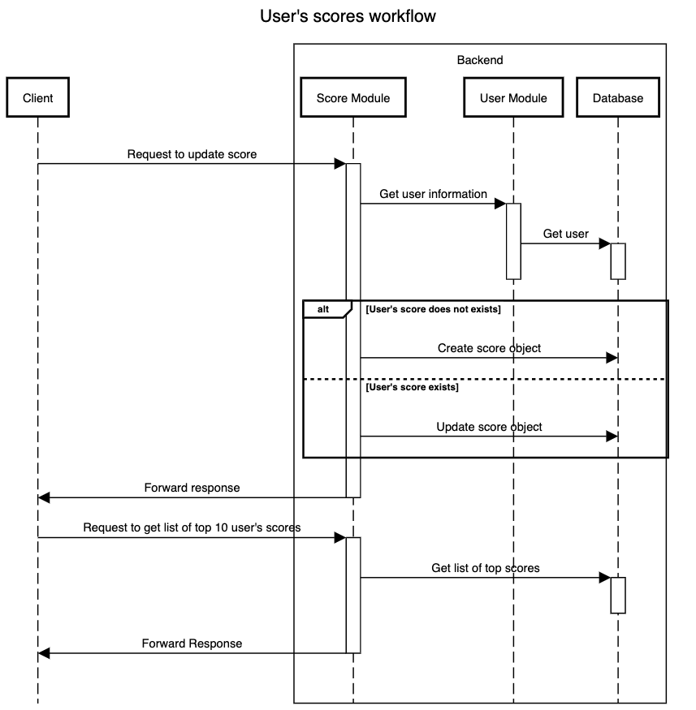

# User's scores module

## 1. Objective

Implement a module to manage user's scores

## 2. Assumptions

- User exists in the database
- User is already logged in

## 2. Requirements

| Requirement                       | User story                                         | Notes |
| --------------------------------- | -------------------------------------------------- | ----- |
| Can get list of top user's scores | As an user, I can get list of top 10 user's scores |       |
| Can update user's score           | As an user, I can update my score                  |       |

## 3. Flow diagram

